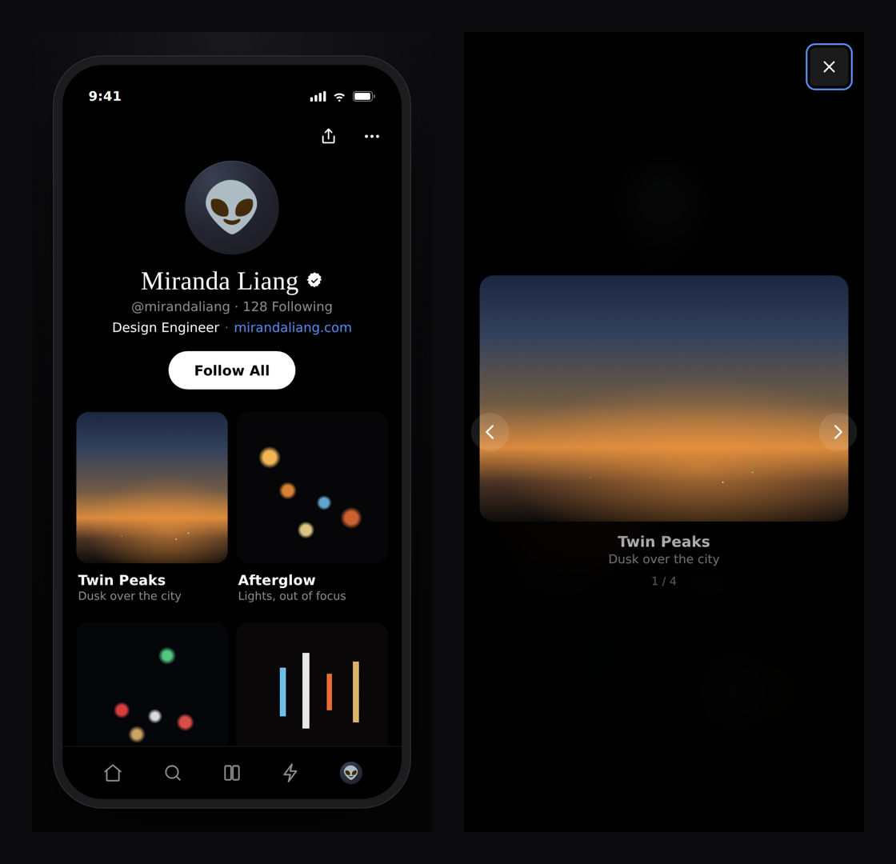

# Profile Gallery

‼️NOTE: This repository is an AI-assisted, code-ready prototype meant to validate interactions, test UI components in the browser, and accelerate developer handoff.

Demo View from my portfolio
https://www.mirandaliang.com/ai-design-experiment

An interactive profile screen with a tap-to-enlarge photo gallery, ported from
the reference design. Dark theme, serif display name, 2-column grid, and an
accessible full-screen photo viewer.

Built as a self-contained React + TypeScript component with design tokens and a
CSS Module — no framework lock-in, no external UI dependencies.



## What's inside

```
profile-gallery/
├── index.html                      # Standalone prototype — open in a browser
├── src/
│   ├── tokens/
│   │   ├── tokens.css              # Design tokens (CSS custom properties)
│   │   └── tokens.ts               # Typed mirror for JS/TS
│   ├── hooks/
│   │   └── useLightbox.ts          # Viewer state: open/close, index, scroll lock, focus
│   └── components/ProfileGallery/
│       ├── ProfileGallery.tsx      # Screen: header + grid + viewer
│       ├── GalleryTile.tsx         # One tappable tile with poster fallback
│       ├── Lightbox.tsx            # Accessible modal photo viewer
│       ├── ProfileGallery.module.css
│       ├── profile.data.ts         # Profile + photo data
│       ├── types.ts                # Public types
│       ├── ProfileGallery.stories.tsx
│       └── index.ts                # Barrel export
├── assets/                         # Drop the four photos here (see assets/README.md)
├── HANDOFF.md                      # Design → engineering handoff spec
├── tsconfig.json                   # strict: true
└── package.json
```

## Quick look (no build)

Open **`index.html`** directly in any browser. The four photos are embedded
inline, so it renders immediately with no assets folder or server — nothing to
set up.

## Use the component

```tsx
import { ProfileGallery, profile, photos } from "./src/components/ProfileGallery";
import "./src/tokens/tokens.css";

export default function App() {
  return (
    <ProfileGallery
      profile={profile}
      photos={photos}
      onFollow={() => {}}
      onPhotoOpen={(photo, i) => analytics.track("photo_open", { id: photo.id, i })}
    />
  );
}
```

`ProfileGallery` renders the **screen only** (no device frame). Wrap it in your
own container to size it. The Storybook `Default` story shows it inside a phone
frame for reference.

### Props

| Prop          | Type                                | Notes                             |
| ------------- | ----------------------------------- | --------------------------------- |
| `profile`     | `ProfileData`                       | Header content.                   |
| `photos`      | `Photo[]`                           | Gallery items.                    |
| `onFollow`    | `() => void`                        | Primary CTA press.                |
| `onPhotoOpen` | `(photo, index) => void`            | Fires when a photo opens.         |
| `className`   | `string`                            | Extra class on the root element.  |

## Photo assets

The four uploaded originals map to gallery slots by filename. Drop them into
`assets/` (or your app's `public/assets/`):

| Filename        | Title      | Caption                 |
| --------------- | ---------- | ----------------------- |
| `DSC06136.JPG`  | Twin Peaks | Dusk over the city      |
| `DSC02319.jpeg` | Crosstown  | Traffic at a standstill |
| `DSC06140.JPG`  | Afterglow  | Lights, out of focus    |
| `DSC02322.jpeg` | Lombard    | Fuel, any hour          |

Until a file is present, a CSS **poster fallback** renders in its place, so the
layout never breaks during handoff or review.

## Interaction & accessibility

- Tap / click / `Enter` / `Space` on a tile opens the viewer.
- Viewer follows the WAI-ARIA dialog pattern: `role="dialog"`, `aria-modal`,
  focus moved in on open, focus trapped to the controls, and focus restored to
  the originating tile on close.
- `Esc` closes; `←` / `→` navigate; swipe navigates on touch.
- Background scroll is locked while open.
- Visible keyboard focus, and `prefers-reduced-motion` is respected.

## Scripts

```bash
npm run typecheck   # tsc --noEmit (strict)
npm run storybook   # component explorer
```

See **[HANDOFF.md](./HANDOFF.md)** for the full spec: tokens, redlines, states,
a11y checklist, and the Tailwind token mapping.
